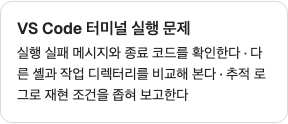
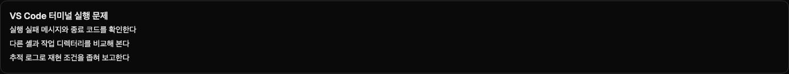

# Responsive LinkCard density — Site #61

> **Authority:** RECORD\
> **Owner:** Site #61 responsive LinkCard calibration evidence\
> **Scope:** the implementation and comparison revisions named below\
> **Read when:** inspecting the measurements and rationale behind the ko-KR generation-budget recommendation\
> **Evidence scope:** local macOS/Playwright Chromium validation on 2026-10-07; no current CI or deployment claim

The [content consumption contract](../../content-consumption-contract.md#markdown--mdx-linkcard-boundary) owns the current Site recommendation. This record preserves the revision-bound comparison and its limits.

Local validation: 2026-10-07, macOS, Playwright Chromium. Exact tested implementation revision and fixture hash are recorded in `validation.json` and `calibration.json`. Evidence commits only add reports/images after the tested implementation commit.

Production component/contract revision: `8d45c366d41ba7ca3911d530aa65f04bec99294d` (offline canonical build and full 30-test regression passed at that clean revision). Final comparison revision: `3199d807ffd68e0b473461173ab9ee834a8da18e` (only a test-corpus phrase changed; fixture build/verifier passed with `workingTreeDirty: false`). Static/unit/type checks passed against these implementation bytes; remote CI is tracked in the PR rather than inferred from local results.

## Decision

Use **24 Unicode code points per semantic fragment, ko-KR**, as the Site recommendation for Engine's explicit `maxCharactersPerLine` preparation input. Keep summary typography at **14px / 21px line height**, with 1rem padding. No renderer rejection, shortening, schema rename or permanent producer default is introduced.

One DOM holds three unchanged ordered fragments. Narrow cards use inline flow with a literal, visually readable ` · ` separator, hidden from assistive technology. At **36rem of card content width**, a container query switches to three rows with 4px gaps and hides separators. This preserves order in both presentations and handles a narrow card even in a wide viewport. Out-of-budget fragments remain visible through natural wrapping, including long unbroken text.

## Comparison method

First round: **18 / 24 / 30**, the same five topics and metadata, same renderer/font/padding. `apps/web/tests/link-card/calibration-corpus.json` contains independently authored summaries for each budget, not truncated variants. Each fragment is checked using Unicode code points; three-fragment order is compared against the actual DOM. A sixth fixture repeats Hangul, wide Latin `W` and emoji to each bound and tests long-token containment.

Topics/support are grounded in the cached semantic summaries in [Docs manifest at 3adda2d](https://github.com/ooMia/oomia.github.io.docs/blob/3adda2d9440d4c3566bee9d4a513c484d41aa261/derived/external-links.json). Candidate phrases are **hand-authored Site fixtures, not real Ollama output**. Project status descriptions are dated snapshots, and the missing-file topic describes the cached summary rather than asserting a current fetch result. No new target-page or model request occurs during build/render/tests.

Recovery found [Docs #16](https://github.com/ooMia/oomia.github.io.docs/issues/16) already closed with real backfill and immediate-repeat Evidence. That manifest uses 14-code-point fallback presentations. The prior handoff's pending-persistence assumption is superseded by live state. This change does not move Site's pinned Docs gitlink or rewrite those records. The real manifest supplies corpus subject matter; the rendered comparisons remain fixtures, not exact-revision real-v2 delivery proof.

## Rendered measurements

Measured after hydration/fonts settled in light and dark at **320 / 390 / 575 / 640 / 768 / 1440px**. Card content widths **575 / 576 / 577px** verify the container transition independently; a 280px container in a 1440px viewport verifies narrow composition. A 160-character unbroken `W` fragment verifies preservation and wrapping outside the candidate budgets.

| Budget | 320px semantic summary / card height | 390px semantic summary / card height | 768/1440px | 320px glyph boundary |
| --- | --- | --- | --- | --- |
| 18 | 3 lines / 122.59px | 2 lines / 101.59px | 3 ordered single-line rows / 130.59px | 4 lines |
| **24** | **3 lines / 122.59px** | 3 lines / 122.59px | 3 ordered single-line rows / 130.59px | 6 lines |
| 30 | 4 lines / 143.59px | 3 lines / 122.59px | 3 ordered single-line rows / 130.59px | 6 lines |

All five semantic topics share these measured heights; these fixtures have the same title height and no preview image. Glyph fixtures deliberately test worst-case width and are not semantic-density examples. All candidates preserve text, order and containment without ellipsis or clipping. Raw measurements include each fragment's text, range containment, visual-line count, summary/card dimensions, display mode and font size. Width or theme changes do not change producer text.

## Semantic assessment

Manual inspection of the authored fixture phrases, assessed against the cached source support:

| Topic | 18 | 24 | 30 |
| --- | --- | --- | --- |
| Terminal diagnosis | Clear error → shell/folder → logs progression; omits exit-code/reproduction detail | Names exit codes, working directory and reproduction conditions; useful specificity | Adds unresolved-problem reporting and shell settings, but costs another narrow line |
| Obsidian links | Both formats, note/heading/block targets, display name are intact | Explains navigation to a specific location and adapting link text to context | Adds repeated-name alias management; relevant but secondary |
| IntelliJ editing | Toolbar → duplicate/move → folding progression; generic toolbar action | Names floating toolbar and code-line operations; naturally readable | Adds commenting, reformatting and custom folding regions; denser enumeration |
| Missing file | Understandable error → revision/path → outcome, but repeats the error | Revision/path verification completes the diagnosis; first fragment is self-contained | Very similar useful information to 24; expansion gives little benefit |
| Project overview | State grouping → backlog/in-progress → completed/cancelled flow | Explicitly separates completed/cancelled work and explains overall progress | Adds processing-result context, with modest gain over 24 |

All variants preserve information progression; none merely copies the title/preview description. The 18 variants are useful but omit concrete details in several topics. The 24 variants retain the core distinctions with natural Korean fragments and fewer lists of secondary actions than 30. In this corpus, 30 adds detail unevenly and costs 21px at 320px, while 24 adds useful specificity over 18 at the same 320px height. This is sufficient convergence for a reversible **24** recommendation; a second 24/28/32 round is unnecessary for this slice. Revisit it if real generation shows systematic omissions or awkward compression.

No claim is made that increasing the budget fixes producer fallback quality. The real 14-bound fallback records include terse fragments such as `Troubleshoot` / `Diagnose` / `VS Code 터미널`; rendering cannot repair their semantics. [Engine #103](https://github.com/ooMia/oomia.github.io.engine/issues/103) owns actual model behavior. Engine may apply 24 explicitly, then Docs can re-prepare presentation under its existing reuse rules without recreating semantic records or refetching preview solely for this length change.

## Validation and limits

`vp run --filter web test:link-card` builds the isolated six-route fixture with the no-network preload, runs the original native Markdown/MDX/fallback/navigation regression and the density comparison. `calibration.json` binds the corpus hash to measurements; `validation.json` binds execution to the Site/Docs revisions and local Chromium version. Candidate screenshots show the terminal topic in narrow/wide layouts. Full comparison screenshots and other intermediate observations are generated under ignored `apps/web/link-card-evidence`.

Local checks: `vp check --no-fmt`; **92 unit tests**; web/UI typechecks and isolated-fixture Astro check; `BASE_PATH=/ vp run --filter web build:offline` (**11 pages**); `test:link-card`; full `test:e2e` (**30 desktop/mobile tests**); `git diff --check`. Results and tested SHA are recorded alongside the generated reports. The no-network preload blocks Node fetch/http(s) during build; fixture browser external requests are blocked, except local SVG bytes for the historical remote-image fixture. This is a test probe, not an OS security sandbox.

Integration, remote CI, cross-OS execution, actual Ollama candidates, real-v2 Site publication and Pages delivery are separate evidence. The older [#53 measurements](../mdx-link-card/README.md) remain historical; their 14-bound recommendation is superseded by this responsive calibration.

