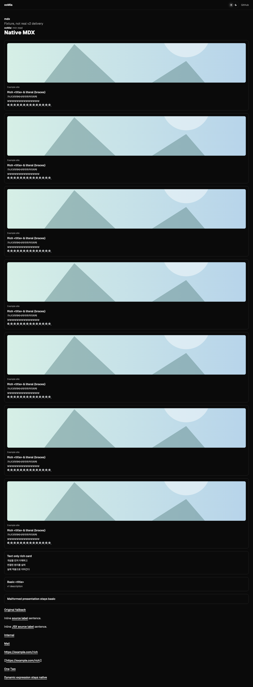

# Native MDX LinkCard evidence

Source tree: `05991c6c0bc52150ebf79d5f0843a5aa602ed98e`. Docs gitlink: `feda09afb4343028be4c680fc5ba9dcf267b6366`. Local validation: 2026-10-07, macOS, Playwright Chromium. This record names the implementation tree validated locally; the evidence-only commit does not change that implementation.

## Outcome and owning decisions

Site #53 production core is implemented. Native `.md` keeps ordinary anchors; native `.mdx` maps standalone standard links to a Site-owned Astro component. No canonical Docs bytes/gitlink were changed. PR #59 remains revision-bound investigation history. This branch removes the executable spike tree/script, web's spike-only Sätteri dependency, legacy HAST LinkCard implementation/tests/exports, and historical `LinkCardData` alias. The rejected renderer is absent from the final diff and normal test discovery.

`@workspace/md` owns normalized MDAST/MDX detection and an independent standalone predicate; Site owns local producer projection, typed compact props, component target and visual DOM. Standard inline/full/collapsed/shortcut references and lowercase JSX anchors normalize identically. Static JSX string/parenthesized/template-literal hrefs use parser-provided ESTree only; missing metadata fails closed. The Acorn fallback and its direct dependency are removed. Production remark adapters use standard MDAST/MDX ecosystem types, not Sätteri AST types. CommonMark label matching/first-definition precedence belongs to the parser plus declared `mdast-util-definitions`, without custom label normalization or definition collection. Dynamic hrefs, spreads, uppercase components and ambiguous attributes remain native. Authored target/rel/class/title attributes are retained. Standalone root/blockquote/list-item blocks are eligible; traversal stays inside these block containers and lists. Tables, footnotes (including nested blockquotes), and authored JSX containers retain native rendering. Inline/internal/non-HTTP/multiple-content/vendor-only links are not cards. External absolute HTTP(S) URLs follow WHATWG URL semantics; internal/file destinations stay authored in native nodes, with no path-case/Unicode/encoding repair or document/Git lineage identity.

## Public processor choice and trade-offs

The initial Sätteri MDX probe rejected the standard multiline JSX spelling `<a\n href="https://example.com/rich"\n>Label</a>` before any semantic visitor ran (`mdx-jsx:unexpected-character`). A single-line tag with multiline children did parse. The production choice therefore uses [Astro's documented per-MDX processor option](https://docs.astro.build/en/guides/integrations-guide/mdx/#processor), `mdx({ processor: unified(...) })`, with the peer-compatible official `@astrojs/markdown-remark@7.3.0`. `.md` keeps its existing native Sätteri processor/features.

Benefits: actual standard multiline JSX support, parser ESTree metadata, public Astro collection/render/component/asset/heading handling, one native compilation per document. Costs: remark/MDX dependencies alongside the native Markdown processor and a tiny reading-time data adapter sharing the existing counting policy. There is no private Astro fork or custom document compilation. MDX supports standard MDX plus GFM; Sätteri-specific math/directive/wikilink/heading-attribute extensions are not added to the MDX remark pipeline. Existing canonical content, assets and Callout rendering passed the full regression suite. Additional MDX extensions need an explicit owner/tested integration, and must not expand LinkCard eligibility accidentally.

Trust boundary: MDX remains executable, repository-trusted source through Astro's existing native build, not a sandbox for arbitrary untrusted documents. Metadata is local untrusted data projected into escaped text and credential-free HTTP(S) URLs. Compact props exclude provider full summary, provenance and model/fetch internals. No network lookup enriches a record at build or render time. Remote image URLs are output directly for the browser; no download/optimization/self-hosting was introduced. Fixture browser image requests are fulfilled with local SVG test data; other external fixture requests are aborted.

## Fixture contract boundary

Site implementation no longer waits for Docs #16 to materialize real v2 data. `apps/web/tests/link-card/manifest.json` is the **producer-compatible golden manifest** for this slice and is pinned to the Engine producer contract on main revision `ae94012c0a74d1069aabda1c09df7c5f9acfa093` ([contract](https://github.com/ooMia/oomia.github.io.engine/blob/ae94012c0a74d1069aabda1c09df7c5f9acfa093/docs/external-link-records.md)). It includes the producer-owned core/provenance fields that Site intentionally projects away: `generatedAt`, `lilys`, preview `resolvedUrl/fetchedAt`, presentation `maxCharactersPerLine/method`, and optional semantic/full-summary data.

The golden file contains only records valid under that provisional v2 interface: a fully rich record, a text-only rich record with an attempted unavailable preview, a first-slice-compatible basic record, and a long-metadata basic record with an available text preview. `manifest-invalid.json` is deliberately **not** producer-compatible; it is isolated negative input verifying malformed optional presentation/basic fallback and unusable core metadata/original-link fallback.

The current consumer baseline is intentionally revision-bound rather than permanently versioned in the payload. Future Engine contract changes remain allowed; a breaking change requires an explicit fixture/Site migration instead of silently changing this test input. Docs #16 remains responsible for real validation/merge/persistence and later replacement of this golden fixture with revision-bound real manifest evidence.

## Validation

| Check                                                              | Result                                                                      |
| ------------------------------------------------------------------ | --------------------------------------------------------------------------- |
| `vp check --no-fmt`                                                | PASS, lint/types, 0 diagnostics                                             |
| `vp test`                                                          | PASS, 92 tests in 8 files; no spike/legacy HAST tests                       |
| `vp run --filter web typecheck`                                    | PASS, 42 files, 0 errors/warnings/hints                                     |
| `vp run --filter @workspace/ui typecheck`                          | PASS                                                                        |
| `vp exec --filter web -- astro check --root tests/link-card/astro` | PASS, 5 files, 0 diagnostics                                                |
| `vp run --filter web build:offline`                                | PASS, pinned canonical corpus; fetch/http(s) forbidden in build workers     |
| `vp run --filter web test:link-card`                               | PASS, same production processors/component in isolated native Astro fixture |
| `vp run --filter web test:e2e`                                     | PASS, full 30 desktop/mobile tests                                          |
| `vp install --frozen-lockfile`                                     | PASS, current lockfile                                                      |
| `git diff --check`                                                 | PASS                                                                        |

The no-network preload is a build probe blocking Node fetch/http(s), not an OS network security sandbox. Standard local static-asset optimization is unchanged. Full canonical E2E permits existing optional image/provider loading; the isolated LinkCard fixture blocks external traffic and uses only local synthetic image bytes. Neither result claims cross-OS execution or deployment.

Canonical rendered routes: `/articles/tech/log/tdd-dev-flow/` demonstrates `.md` ordinary-link regression and `/articles/tech/log/woowa-precourse-parameterized-test/` demonstrates native MDX/Callout preservation. Synthetic v2 fixture routes are `/markdown/` and `/mdx/` in `apps/web/tests/link-card/astro/dist`; they are not canonical Docs articles or deployed routes.

Shared native processor fixture routes `/common-markdown/` and `/common-mdx/` render identical standard headings/slugs and English/Korean reading-time statistics from the same source. This is a shared output contract, not extension feature parity.

Fixture outcomes: Markdown cards **0**; MDX cards **10** (rich **8**, basic **2**); ordered summary rows **24**. It covers standard link forms, original-label missing-metadata fallback, malformed optional presentation/basic fallback, remote-image props, text-only rich card, inline native labels and navigation attributes. No nested links/buttons or paragraph-wrapped cards. Keyboard focus/Enter and mobile touch first tap keep external navigation; no sidebar/dialog is present.

## Typography calibration

The current 14px summary typography and 1rem card padding were measured at **320, 390, 768 and 1440px**, in both light and dark themes, after fonts settled. The 320px fixture has **254px** of summary-row width. All 24 rows remain one line without overflow, clipping or ellipsis at the tested bound: **14 Unicode code points per row**, locale **ko-KR**. Boundary fixtures include Hangul, wide `W` glyphs and emoji. The initial 16-emoji row wrapped at 320px; 14 passed. Ordinary Korean semantic fragments also passed.

Recommend `maxCharactersPerLine: 14` for the corresponding Engine ko-KR preparation constraint. This value is tied to this typography, viewport range, fixture glyphs and local font environment; it is not a universal width guarantee across arbitrary scripts/fonts/zoom. Recalibrate on font/card/breakpoint changes or another locale. Site preserves overlong producer rows with natural wrapping rather than clipping or inventing shortened text; an 80-Hangul-row probe verifies this behavior. Engine's default remains deliberately uncalibrated until its owner applies the constraint; this Site change does not edit the producer.

## Remaining owner boundaries

Engine #79 and Docs #16 were live/open during recovery. The pinned manifest remains v1; the rich inputs are explicit fixtures derived from the current producer field contract. No real Ollama output, Docs v2 preparation/backfill, real-v2 provenance, merge or Pages delivery is claimed by these local results. CI is reported separately against the current PR head. Site #54's desktop hover/focus contextual sidebar remains deferred; the single-anchor DOM and ordinary inline links preserve its future interaction boundary. No mobile drawer/sheet/detail button is added.

Maintenance follow-up: move stable DOM/navigation regression assertions from `verify.mjs` into Playwright-native tests and separate evidence/calibration generation; this is not a cleanup merge blocker.

## Consumer completion follow-up (2026-10-07)

Implementation/test source: `29a7866f84a8f9681e0ed62b75067bb62b4ecfc7`. Engine baseline and Docs gitlink remain the revisions above. [Machine-readable validation](followup-validation.json) binds this clean Site revision to the SHA-256 of both fixture inputs and the actual local Chromium runtime. Golden input remains synthetic producer-compatible data; the negative input intentionally violates the contract.

The fixture split at `ca1726a297ff026a0bf8b0786dd861bc3daab85e` introduced a reproducible fixture integration regression: compilation read golden + negative records, while the component read only golden records. The isolated browser check failed with **9 cards instead of 10**; malformed presentation became a URL-only anchor. Both phases now import one fixture resolver. The malformed presentation renders a basic card with its metadata title, with no summary rows. Production already shares its local resolver between the processor and component; this fix aligns the fixture with that architecture.

Card text now naturally wraps long unbroken titles, site names and descriptions, preserving mobile containment without shortening producer text. A separate `/resilience/` fixture renders one long-metadata basic card and verifies that unusable core metadata preserves both CommonMark and JSX labels, formatting and authored attributes. No new schema, policy or public interface decision was required.

The verifier now compares every rich card's exact row order and locale against the golden manifest. It waits for provider hydration before applying and asserting each light/dark theme, avoiding a theme reset after route changes. Browser network remains blocked except for local SVG preview bytes; no real target-page metadata or provider runtime is used.

| Current check | Result |
| --- | --- |
| `vp check --no-fmt`, `vp test` | PASS; 92 unit tests in 8 files |
| `vp exec --filter web -- astro sync` | PASS |
| Web/UI typechecks, isolated-fixture `astro check` | PASS; no diagnostics |
| `BASE_PATH=/ vp run --filter web build:offline` | PASS; 11 pinned-corpus pages, Node fetch/http(s) forbidden |
| `vp run --filter web test:link-card` (fixture build + verifier) | PASS; 5 fixture pages; `/mdx/`: 10 cards (8 rich, 2 basic), 24 ordered rows; `/markdown/`: 0 cards |
| 320/390/768/1440px × light/dark | PASS; 14-code-point rows remain single-line; long metadata remains contained |
| Keyboard Enter, touch first tap, missing/invalid metadata | PASS; ordinary navigation and safe fallbacks |
| `vp run --filter web test:e2e` | PASS; all 30 desktop/mobile tests |
| `git diff --check` | PASS |

Tests ran against the same renderer/fixture bytes committed in the named implementation revision. The final verifier ran with that exact clean HEAD. Subsequent evidence-only commits do not change the tested code or fixture inputs. Browser checks ran locally on macOS, not in automatic PR CI or an OS matrix. Remote CI is reported separately in PR #60 against its final head.

Site #53 component/projection/MDX implementation has no remaining implementation blocker under this fixture-based acceptance boundary. Real Docs v2 persistence/backfill and exact-Docs-revision integration remain Docs #16's follow-up responsibility; #54 detail interaction, merge and Pages delivery remain separate work.
