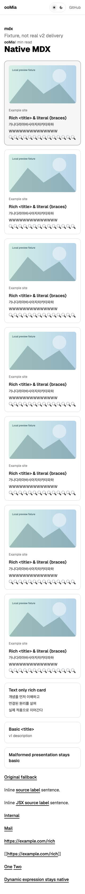

# Native MDX LinkCard evidence

Source tree: `0beb85f03251050bc20653769ec6dbb57903328a`. Docs gitlink: `feda09afb4343028be4c680fc5ba9dcf267b6366`. Local validation: 2026-10-07, macOS, Playwright Chromium. This record names the implementation tree validated locally; the evidence-only commit does not change that implementation.

## Outcome and owning decisions

Site #53 production core is implemented. Native `.md` keeps ordinary anchors; native `.mdx` maps standalone standard links to a Site-owned Astro component. No canonical Docs bytes/gitlink were changed. PR #59's earlier spike remains on its original branch and in the isolated investigation directory; the old visual HAST adapter has moved into that directory. Production imports no experimental processor, generated function-body evaluator or React static SSR bridge.

`@workspace/md` owns normalized MDAST/MDX detection and an independent standalone predicate; Site owns local producer projection, typed compact props, component target and visual DOM. Standard inline/full/collapsed/shortcut references and lowercase JSX anchors normalize identically. Static JSX string/parenthesized/template-literal hrefs use parser-provided ESTree, with a small non-evaluating JS parser fallback for adapters lacking it. Dynamic hrefs, spreads, uppercase components and ambiguous attributes remain native. Authored target/rel/class/title attributes are retained. Inline/internal/non-HTTP/multiple-content/vendor-only links are not cards.

## Public processor choice and trade-offs

The initial Sätteri MDX probe rejected the standard multiline JSX spelling `<a\n href="https://example.com/rich"\n>Label</a>` before any semantic visitor ran (`mdx-jsx:unexpected-character`). A single-line tag with multiline children did parse. The production choice therefore uses [Astro's documented per-MDX processor option](https://docs.astro.build/en/guides/integrations-guide/mdx/#processor), `mdx({ processor: unified(...) })`, with the peer-compatible official `@astrojs/markdown-remark@7.3.0`. `.md` keeps its existing native Sätteri processor/features.

Benefits: actual standard multiline JSX support, parser ESTree metadata, public Astro collection/render/component/asset/heading handling, one native compilation per document. Costs: remark/MDX dependencies alongside the native Markdown processor and a tiny reading-time data adapter sharing the existing counting policy. There is no private Astro fork or custom document compilation. MDX supports standard MDX plus GFM; Sätteri-specific math/directive/wikilink/heading-attribute extensions are not added to the MDX remark pipeline. Existing canonical content, assets and Callout rendering passed the full regression suite. Additional MDX extensions need an explicit owner/tested integration, and must not expand LinkCard eligibility accidentally.

Trust boundary: MDX remains executable, repository-trusted source through Astro's existing native build, not a sandbox for arbitrary untrusted documents. Metadata is local untrusted data projected into escaped text and credential-free HTTP(S) URLs. Compact props exclude provider full summary, provenance and model/fetch internals. No network lookup enriches a record at build or render time. Remote image URLs are output directly for the browser; no download/optimization/self-hosting was introduced. Fixture browser image requests are fulfilled with local SVG test data; other external fixture requests are aborted.

## Validation

| Check                                                                    | Result                                                                      |
| ------------------------------------------------------------------------ | --------------------------------------------------------------------------- |
| `vp check`                                                               | PASS, formatting/lint/types, 0 diagnostics                                  |
| `vp test`                                                                | PASS, 91 tests in 12 files, including existing isolated spike tests         |
| `vp run --filter web typecheck`                                          | PASS, 42 files, 0 errors/warnings/hints                                     |
| `vp run --filter @workspace/ui typecheck`                                | PASS                                                                        |
| `vp exec --filter web -- astro check --root tests/link-card/astro`       | PASS, 5 files, 0 diagnostics                                                |
| `vp run --filter web build:offline` | PASS, pinned canonical corpus; fetch/http(s) forbidden in build workers     |
| `vp run --filter web test:link-card`                                     | PASS, same production processors/component in isolated native Astro fixture |
| `vp run --filter web test:e2e`                                           | PASS, full 30 desktop/mobile tests                                          |
| `git diff --check`                                                       | PASS                                                                        |

The no-network preload is a build probe blocking Node fetch/http(s), not an OS network security sandbox. Standard local static-asset optimization is unchanged. Full canonical E2E permits existing optional image/provider loading; the isolated LinkCard fixture blocks external traffic and uses only local synthetic image bytes. Neither result claims cross-OS execution or deployment.

Canonical rendered routes: `/articles/tech/log/tdd-dev-flow/` demonstrates `.md` ordinary-link regression and `/articles/tech/log/woowa-precourse-parameterized-test/` demonstrates native MDX/Callout preservation. Synthetic v2 fixture routes are `/markdown/` and `/mdx/` in `apps/web/tests/link-card/astro/dist`; they are not canonical Docs articles or deployed routes.

Fixture outcomes: Markdown cards **0**; MDX cards **10** (rich **8**, basic **2**); ordered summary rows **24**. It covers standard link forms, original-label missing-metadata fallback, malformed optional presentation/basic fallback, remote-image props, text-only rich card, inline native labels and navigation attributes. No nested links/buttons or paragraph-wrapped cards. Keyboard focus/Enter and mobile touch first tap keep external navigation; no sidebar/dialog is present.

## Typography calibration

The current 14px summary typography and 1rem card padding were measured at **320, 390, 768 and 1440px**, in both light and dark themes, after fonts settled. The 320px fixture has **254px** of summary-row width. All 24 rows remain one line without overflow, clipping or ellipsis at the tested bound: **14 Unicode code points per row**, locale **ko-KR**. Boundary fixtures include Hangul, wide `W` glyphs and emoji. The initial 16-emoji row wrapped at 320px; 14 passed. Ordinary Korean semantic fragments also passed.

Recommend `maxCharactersPerLine: 14` for the corresponding Engine ko-KR preparation constraint. This value is tied to this typography, viewport range, fixture glyphs and local font environment; it is not a universal width guarantee across arbitrary scripts/fonts/zoom. Recalibrate on font/card/breakpoint changes or another locale. Site preserves overlong producer rows with natural wrapping rather than clipping or inventing shortened text; an 80-Hangul-row probe verifies this behavior. Engine's default remains deliberately uncalibrated until its owner applies the constraint; this Site change does not edit the producer.

## Remaining owner boundaries

Engine #79 and Docs #16 were live/open during recovery. The pinned manifest remains v1; the rich inputs are explicit fixtures derived from the current producer field contract. No real Ollama output, Docs v2 preparation/backfill, real-v2 provenance, merge, CI or Pages delivery is claimed by these local results. Site #54's desktop hover/focus contextual sidebar remains deferred; the single-anchor DOM and ordinary inline links preserve its future interaction boundary. No mobile drawer/sheet/detail button is added.
